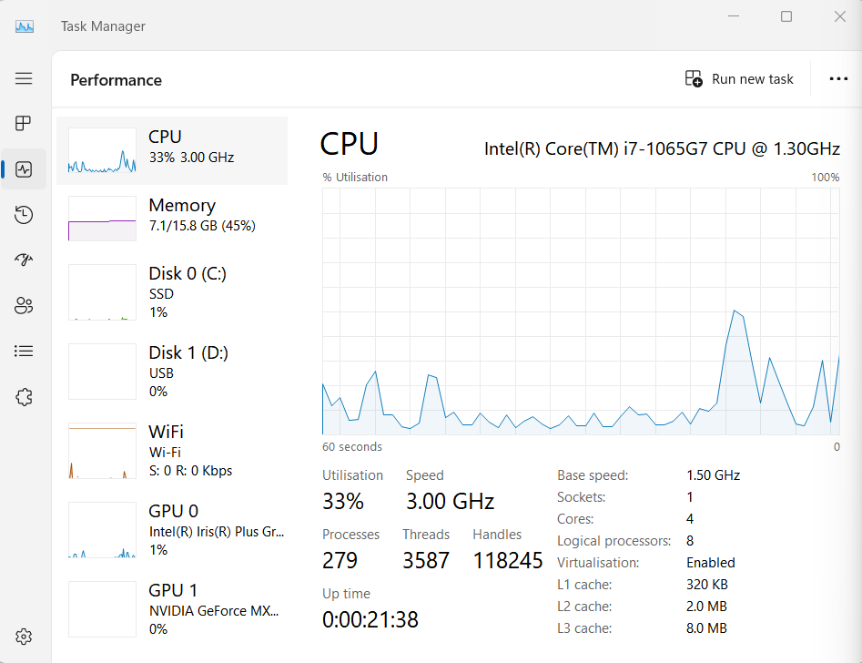
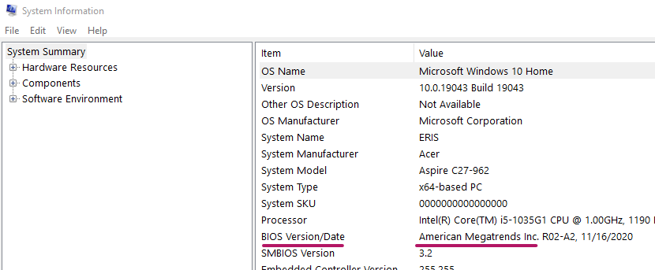
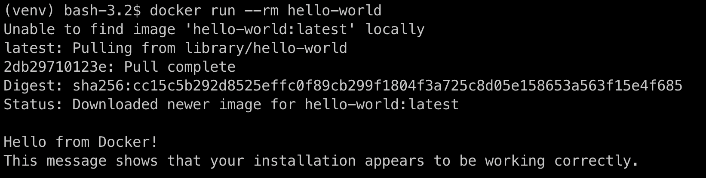

Docker Installation
===================

## Preprequisite: Virtualization
- Hardware-level virtualization must be enabled in your Windows BIOS for Docker to work. This is typically enabled by default on newer Windows machines. To check, open **Task Manager** (right click on your taskbar and choose Task Manager) _- shortcut to Task Manager: Windows key + X_
Go to the **Performance** tab in Task Manager and look for the **Virtualization** setting. If you do not see a **Performance** tab, click the text **More details**.

- If your Task Manager says **Virtualization: Enabled**, then you can skip to the Installation section below.
- If your Task Manager says **Virtualization: Disabled**, then you will need to enable virtualization in your BIOS.
-- The BIOS (Basic Input Output System) is firmware that's a part of your computer's motherboard. It is independent of the operating system of your PC, such as Windows 10, Windows 11, or Linux. 
-- There are many different versions of BIOS software, and thus we cannot provide you with step-by-step instructions on how to enable virtualization. You will need to look it up by finding your BIOS version, then using a search engine to find out how to enable virtualization on your BIOS specifically.
-- To find out your BIOS version, enter **sysinfo** into your Windows search bar, which will bring up the System Information panel:

## Installation
- Go to [https://hub.docker.com/editions/community/docker-ce-desktop-windows/] to download the latest version of Docker Desktop for Windows.
- Once the file has finished downloading, start the installation by clicking on your downloaded file.
- If prompted by a message "Do you want to allow this app to make changes to your device?", Click "**Yes**".
- If prompted by an alert asking if you would like to allow access on public or private networks, click "**Allow access**" using the default settings.
- At the **Configuration** dialog, make sure that the checkbox to "**Install the required Windows components for WSL 2" is checked**.
- Click **Close and Restart** when prompted.

## Install WSL2
- Note: WSL2 is a separate install from Docker Desktop.
- After you reboot, you will be prompted with a dialog stating that "**WSL 2 installation is incomplete.**" 
- [Click this link to download the WSL 2 installer].()
- Run the downloaded installer file.
- Restart your computer once again (even if the installer does not mention it).
- Docker Desktop should start automatically on its own. If it does not, start it. 
- The first time you start Docker Desktop, it may ask you to go through a Quick Start Tutorial. This is not required for this course, and it's up to you whether or not to go through the tutorial or skip it.
- Continue to the [Test Docker installation]() section below.

## Test Docker installation
- Open a new bash terminal, such as the VS Code integrated terminal, Git Bash, or the macOS Terminal
- At the prompt, type:
`docker --version`
> - Example output:
`$ docker --version
Docker version 20.10.8, build 3967b7d`
> - Your version may be a later version, but it should not be any older than this version.
> - If you receive an error, please double-check the instructions above, or ask your instructor/the Nucamp community for help.

## Hello world!
- In keeping with tradition, we will further test the Docker installation using a "hello world" program.
- You will next run a command that will pull a Docker image (a template for a containerized application) from the public Docker image repository, then create and run a container from that image. The application that runs in that container will simply print a hello message from Docker to your terminal, then exit. 
- Run the following command to accomplish all of the steps described above:
`docker run --rm hello-world`
> - Example output:

> - That's it! If you see the above message, you are all set.
> - If not, please reach out to your instructor or the Nucamp chat server community for help.